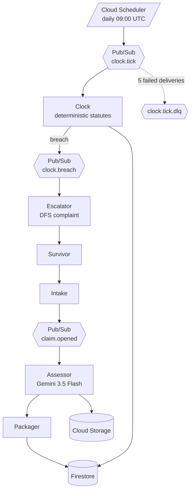

# Prothesmia

**προθεσμία** — *the appointed time*: in Greek law, the deadline fixed by statute,
after which a right lapses.

An autonomous agent fleet that tracks the statutory deadline on a stalled insurance
claim and escalates to the state regulator when the carrier blows it.

Built for the **All Things Agentic Hackathon** (Google × Devpost), Taskmaster track.

---

## The problem

After a hurricane, tens of thousands of claims land in the same week against an
adjuster pool sized for a normal month. People live in hotels, or in the driveway,
while a file sits in a queue.

**Most of that delay is not denial. It is non-response.**

Florida law is not the problem. Florida law is unusually clear:

- **Fla. Stat. §627.70131(1)(a)** — 7 days to acknowledge a communication about a claim
- **Fla. Stat. §627.70131(7)(a)** — 60 days to pay or deny, in whole or in part

The deadlines exist. Nobody counts the days. Counting requires knowing the statute
exists, knowing which trigger date starts it, tracking it across weeks while displaced,
and knowing the Department of Financial Services takes complaints.

That is clerical work no displaced person does from a hotel room. It is exactly what
an agent should do.

## What it does

```
address + policy
   ↓
FEMA disaster declaration for that county + date          ← public
   ↓
post-event aerial imagery for that parcel                 ← public (NOAA NGS)
   ↓
Gemini multimodal damage assessment from imagery
   ↓
parcel records: structure age, footprint, type            ← public
   ↓
evidence packet, every element carrying source + timestamp
   ↓
statutory deadline tracked daily per Fla. Stat. §627.70131
   ↓
deadline breached → draft DFS complaint, statute cited
```

## Architecture

**Models extract. Rules decide.**

Gemini reads the messy documents — aerial imagery, parcel records. A deterministic,
versioned, citable statute module does the arithmetic and renders the breach.

"An AI thinks your carrier is late" is not something a survivor can take to a
regulator. "Notice received 2026-06-25; Fla. Stat. §627.70131(7)(a) requires payment
or denial within 60 days; deadline 2026-08-24; breached" is.

The Clock and the statute module **never call an LLM**. `agents/statutes/rules.py` is
pure arithmetic over dates, no I/O, no network, fully unit tested.

| Agent | Trigger | LLM? | Status |
|---|---|---|---|
| **Clock** | Cloud Scheduler → Pub/Sub `clock.tick`, daily | **No — deterministic** | ✅ built, deployed, ticking |
| **Intake** | User submits address + policy | Partial | *(not built yet)* |
| **Assessor** | Pub/Sub `claim.opened` | Yes — Gemini 3.5 Flash | *(not built yet)* |
| **Packager** | After Assessor | Partial | *(not built yet)* |
| **Escalator** | Pub/Sub `clock.breach` | Yes — drafting only | *(not built yet)* |



### Engineering decisions

**Decoupling.** Agents communicate only through Pub/Sub events. No agent calls another
directly.

**State.** Firestore. `clock_checks` is append-only — one row per claim per day, never
updated, never deleted. The Clock can sleep for weeks and wake with full context.

**Credentials.** Workload Identity Federation from CI — **no long-lived service account
keys exist anywhere in this project.** The WIF provider carries an attribute condition
scoping it to this repository specifically, so a token minted from any other repo is
rejected. The runtime service account holds three roles (`datastore.user`,
`pubsub.publisher`, `aiplatform.user`), not `editor`.

**Failure handling.** Dead-letter queue on the tick subscription, max 5 delivery
attempts. Pub/Sub is at-least-once, so every write is idempotent by deterministic
document ID:

- `clock_checks/{claim_id}:{YYYY-MM-DD}`
- `breaches/{claim_id}:breach`

Both use create-if-absent semantics. Firing the scheduler twice in one minute produces
four rows, not eight. There is a test for exactly this.

## Honesty

**The demo claim files are constructed.** The FEMA declaration, the NOAA imagery, the
parcel records, and the statutes are real. Every `clock_checks` row is a real execution
at a real timestamp — the Clock has been running daily since 2026-08-16.

Seeded claims carry `constructed: true` in Firestore and are labeled as such in the UI.
No real claimant exists.

The agent assembles and escalates. **It never asserts a damage valuation as fact.**
Output is computation plus citation, never a legal or valuation conclusion.

`TODO(verify)` — whether Florida DFS complaints are machine-filable or web-form only.
If web-form only, the agent drafts the complete complaint, cites the statute, and puts
it one click from filing. The README will say which, honestly, before submission.

## Anchor event

```
FEMA-4834-DR-FL
Incident:          Hurricane Milton
Declaration date:  2024-10-11
Incident period:   2024-10-05 to 2024-11-02
State:             Florida
NOAA NGS imagery:  https://storms.ngs.noaa.gov/storms/milton/index.html
```

## Stack

| Layer | Technology |
|---|---|
| Model | `gemini-3.5-flash` via Vertex AI |
| Agent framework | **Google ADK** (Python) |
| Compute | Cloud Run |
| Messaging | Pub/Sub, Cloud Scheduler |
| State | Firestore (native mode) |
| Storage | Cloud Storage |
| Observability | Cloud Logging, Cloud Trace |
| Frontend | Next.js on Cloud Run *(not built yet)* |

---

## Spin up from zero

Requires: `gcloud` CLI, Python 3.12, a GCP project with billing enabled.

### 1. Project and APIs

```bash
export PROJECT_ID=your-project-id
export REGION=us-central1
gcloud config set project $PROJECT_ID
gcloud services enable run.googleapis.com firestore.googleapis.com pubsub.googleapis.com cloudscheduler.googleapis.com cloudbuild.googleapis.com artifactregistry.googleapis.com aiplatform.googleapis.com storage.googleapis.com secretmanager.googleapis.com
gcloud firestore databases create --location=nam5 --type=firestore-native
```

### 2. Topics

```bash
gcloud pubsub topics create clock.tick
gcloud pubsub topics create clock.breach
gcloud pubsub topics create clock.tick.dlq
```

### 3. Runtime service account

```bash
gcloud iam service-accounts create prothesmia-agents --display-name="Prothesmia Agents"
export SA=prothesmia-agents@$PROJECT_ID.iam.gserviceaccount.com
gcloud projects add-iam-policy-binding $PROJECT_ID --member="serviceAccount:$SA" --role="roles/datastore.user"
gcloud projects add-iam-policy-binding $PROJECT_ID --member="serviceAccount:$SA" --role="roles/pubsub.publisher"
gcloud projects add-iam-policy-binding $PROJECT_ID --member="serviceAccount:$SA" --role="roles/aiplatform.user"
```

### 4. ⚠️ Cloud Build permissions — required, easy to miss

Newer GCP projects do **not** auto-grant these to the default compute service account.
Without them `gcloud run deploy --source` fails with an opaque 403 on the source zip,
and then fails again with no build logs at all.

```bash
export PROJECT_NUMBER=$(gcloud projects describe $PROJECT_ID --format='value(projectNumber)')
export COMPUTE_SA=$PROJECT_NUMBER-compute@developer.gserviceaccount.com
gcloud projects add-iam-policy-binding $PROJECT_ID --member="serviceAccount:$COMPUTE_SA" --role="roles/storage.objectViewer"
gcloud projects add-iam-policy-binding $PROJECT_ID --member="serviceAccount:$COMPUTE_SA" --role="roles/logging.logWriter"
gcloud projects add-iam-policy-binding $PROJECT_ID --member="serviceAccount:$COMPUTE_SA" --role="roles/artifactregistry.writer"
```

### 5. Deploy

```bash
cd agents
gcloud run deploy prothesmia-agents --source . --service-account=$SA --set-env-vars=GCP_PROJECT_ID=$PROJECT_ID --no-allow-unauthenticated --region=$REGION
export AGENTS_URL=$(gcloud run services describe prothesmia-agents --region=$REGION --format='value(status.url)')
```

### 6. Seed

Python clients need Application Default Credentials, which `gcloud auth login` does
**not** provide:

```bash
gcloud auth application-default login
cd ..
GCP_PROJECT_ID=$PROJECT_ID python3 scripts/seed.py
```

### 7. Wire the Clock

```bash
gcloud iam service-accounts create pubsub-invoker --display-name="Pub/Sub Invoker"
gcloud run services add-iam-policy-binding prothesmia-agents --member="serviceAccount:pubsub-invoker@$PROJECT_ID.iam.gserviceaccount.com" --role="roles/run.invoker" --region=$REGION
gcloud projects add-iam-policy-binding $PROJECT_ID --member="serviceAccount:service-$PROJECT_NUMBER@gcp-sa-pubsub.iam.gserviceaccount.com" --role="roles/iam.serviceAccountTokenCreator"
gcloud pubsub topics add-iam-policy-binding clock.tick.dlq --member="serviceAccount:service-$PROJECT_NUMBER@gcp-sa-pubsub.iam.gserviceaccount.com" --role="roles/pubsub.publisher"
gcloud pubsub subscriptions create clock-tick-sub --topic=clock.tick --push-endpoint=$AGENTS_URL/tasks/clock-tick --push-auth-service-account=pubsub-invoker@$PROJECT_ID.iam.gserviceaccount.com --dead-letter-topic=clock.tick.dlq --max-delivery-attempts=5 --ack-deadline=300
gcloud scheduler jobs create pubsub prothesmia-daily --schedule="0 9 * * *" --topic=clock.tick --message-body="tick" --location=$REGION --time-zone="Etc/UTC"
```

> The `serviceAccountTokenCreator` grant takes a few minutes to propagate. The first
> tick after creating it may silently not deliver. Wait and re-fire.

### 8. Verify

```bash
gcloud scheduler jobs run prothesmia-daily --location=$REGION
gcloud scheduler jobs run prothesmia-daily --location=$REGION   # twice, on purpose
```

```bash
GCP_PROJECT_ID=$PROJECT_ID python3 -c "
from google.cloud import firestore
db = firestore.Client(project='$PROJECT_ID')
print('clock_checks:', len(list(db.collection('clock_checks').stream())))
"
```

Four rows, not eight. That is the idempotency guarantee, verified against real
at-least-once delivery.

## Tests

```bash
cd agents
pip3 install -r requirements-dev.txt
pytest
```

24 tests. Golden cases for every statute rule, including the superseded 2021 90-day
version and a tolled case that proves a tolled claim is **not** reported as breached
when the untolled deadline would have passed.

---

## License

Apache-2.0 