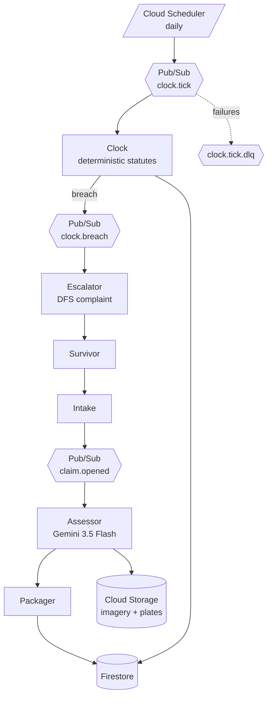

# Prothesmia — Product Spec

**Status:** authoritative. Revision 1, 2026-08-16.
**Read `CLAUDE.md` first.** This document assumes its rules.

---

## 1. One line

Prothesmia tracks the statutory deadline on a stalled insurance claim and
autonomously escalates to the state insurance regulator when the carrier blows it.

## 2. The problem

After a hurricane, tens of thousands of claims land in the same week against an
adjuster pool sized for a normal month. Payouts take months. People live in hotels,
or in the driveway, while a file sits in a queue.

**Most of that delay is not denial. It is non-response.** Claims stall because no
individual survivor has the energy, documentation, or knowledge of state deadline law
to force movement — at exactly the moment they have the least capacity to fight.

Florida law is not the problem. Florida law is unusually clear: §627.70131(1)(a)
gives a carrier 7 days to acknowledge a communication about a claim, and
§627.70131(7)(a) gives it 60 days to pay or deny. The deadlines exist. Nobody counts
the days. Counting requires knowing the statute exists, knowing which trigger date
starts it, tracking it across weeks while displaced, and knowing that the Department
of Financial Services takes complaints.

That is clerical work no displaced person does from a hotel room. It is also exactly
what an agent should do.

## 3. What Prothesmia does

```
address + policy
   ↓
FEMA disaster declaration for that county + date          ← public
   ↓
post-event aerial imagery for that parcel                 ← public (NOAA NGS)
   ↓
Gemini multimodal damage assessment from imagery          ← the visual moment
   ↓
parcel records: structure age, footprint, type            ← public
   ↓
evidence packet, every element carrying source + timestamp
   ↓
statutory deadline tracked daily per Fla. Stat. §627.70131
   ↓
deadline breached → draft state DFS complaint, statute cited     ← the product
```

**The last step is the product.** An agent that autonomously escalates to a regulator
when a carrier stalls is unambiguous high-value action with no hand-holding. Everything
above it is table stakes.

## 4. How this maps to the judging criteria

### Innovation & Operational Utility — 40%

*"How much real-world friction does this remove on its own? We reward autonomous,
high-value action over simple chat."*

- The Clock runs daily for weeks with **no user present**. It is not triggered by a
  human opening an app.
- The Escalator drafts a regulatory complaint on a breach event the human never had to
  notice.
- The friction removed is not minutes of reading. It is the reason claims stall
  indefinitely: nobody is counting.

**The proof artifact:** the `clock_checks` collection. Append-only, one row per claim
per day, real timestamps, unbroken from deploy date to demo day, with two breaches
that fired on their own. That is not a claim of autonomy — it is a trace of it.

### Architectural Discipline & Tech Stack — 30%

*"How do you decouple systems, manage state and memory, secure credentials, and handle
failures?"*

Answer each explicitly in the README and the video:

| They ask | We answer |
|---|---|
| Decoupling | Agents communicate only via Pub/Sub events (`claim.opened`, `clock.breach`). No agent calls another directly. |
| State & memory | Firestore. ADK session services. The Clock sleeps for weeks and wakes with full context — the hackathon's literal theme. |
| Credentials | Workload Identity Federation from CI. **No long-lived service account keys exist anywhere.** Repo-scoped attribute condition so only `khadimswe/Prothesmia` can mint a token. Least-privilege SA: three roles, not `editor`. Secret Manager for runtime secrets. |
| Failure handling | Dead-letter queue on every subscription, max 5 delivery attempts, exponential backoff. Pub/Sub is at-least-once, so every write is idempotent by deterministic document ID. |

**The architectural argument, stated once in the video and once in the writeup:**

> Models extract. Rules decide. Gemini reads the imagery; a deterministic, versioned,
> citable statute module does the arithmetic and renders the breach — because "an AI
> thinks your carrier is late" is not something a survivor can take to a regulator, and
> it is not something that survives scrutiny. Every day counted traces to a statute
> section and a trigger date.

That is a judgment call with a stated tradeoff, which is what architectural discipline
means. Most entrants will have a diagram. Few will have an argument.

### Demo & Production Readiness — 30%

*"A live, unedited demo, a clean architecture diagram, reproducible setup, and visible
proof it runs on Google Cloud."*

- One unbroken take. No cut where the magic happens.
- Cloud Run console, Cloud Scheduler run history, and Vertex AI logs on screen.
- The `clock_checks` collection open in the Firestore console showing real dates.
- README reproducible from zero.
- `min-instances=1` before recording. Backup video recorded.

## 5. The demo — build backwards from this

Four minutes. If a feature does not appear here, it does not get built before Aug 30.

| Time | Beat |
|---|---|
| 0:00–0:25 | The problem, plainly. "Prothesmia — Greek for the appointed time, the deadline fixed by statute after which a right lapses. Florida gives your insurer 60 days to pay or deny. Nobody counts the days." |
| 0:25–0:50 | Claim file screen. Real parcel, real declaration FEMA-4834-DR-FL, real statute on screen. State plainly: claim constructed, everything it reads is real. |
| 0:50–1:40 | Evidence plates. NOAA imagery before/after, Gemini's structured findings beneath each, capture date and source in mono. The visual moment. |
| 1:40–2:20 | The deadline rail. Three claims, three states — comfortable, inside 25%, breached. Cite the statute on screen. |
| 2:20–3:00 | **The breach.** `clock_checks` in the Firestore console: unbroken daily rows since Aug 16, and the row where `breached` flipped true with nobody present. Cloud Scheduler run history alongside. |
| 3:00–3:35 | The generated DFS complaint, in the document face. Every assertion citing its source. One tap to approve. |
| 3:35–4:00 | Architecture diagram, Cloud Run console, Vertex AI logs, DLQ config. |

Close on the breach beat if forced to choose. That is what they remember.

## 6. Architecture — the fleet is the product

One thin foreground surface, four agents that run when nobody is watching.

| Agent | Trigger | Does | LLM? |
|---|---|---|---|
| **Intake** | User submits address + policy | Resolves parcel, matches FEMA declaration, opens the claim | Partial |
| **Assessor** | Pub/Sub `claim.opened` | Pulls NOAA imagery, runs Gemini multimodal assessment, writes structured findings with imagery provenance | **Yes** — Gemini 3.5 Flash |
| **Packager** | After Assessor | Assembles the evidence packet, each element with source + timestamp | Partial |
| **Clock** | Cloud Scheduler, daily | Tracks each claim against its statutory deadline. The only agent that never sleeps. | **No — deterministic** |
| **Escalator** | `clock.breach` | Drafts the DFS complaint with the statute cited, notifies the survivor, files on approval | Yes — drafting only |



Four autonomous agents to one interactive. The diagram argues before anyone reads a word.

## 7. Design system — binding

> Deviation is a defect. The fastest way to lose a design-conscious judge is a purple
> gradient and a rounded pill.

### Reference

**A surveyor's field report.** Grid-ruled paper, precise measurements, stamped dates,
photographic evidence plates with captions. Not a dashboard, not a consumer app, and
emphatically not a government website.

This matters because the product's *output* is an evidence packet. When the interface
looks like the artifact it produces, the design and the argument stop being separate.

### Palette — `web/styles/tokens.css` is the only file permitted to define these

```css
:root {
  --paper:   #FAF9F6;  /* background, warm off-white — field notebook */
  --grid:    #E8E5DE;  /* hairlines, grid rules */
  --graphite:#232629;  /* primary text, structure */
  --slate:   #5A6169;  /* secondary text, labels */
  --faint:   #9AA0A6;  /* tertiary, metadata */
  --signal:  #C2410C;  /* THE accent — deadlines and urgency ONLY */
  --breach:  #8B1A1A;  /* deadline passed / escalated. deep, not alarm-red */
  --verified:#3F6152;  /* sourced and confirmed. muted pine, never neon */
}
```

Dark mode inverts: `--paper #16181A`, `--graphite #F0EEE9`, `--grid #2A2D30`,
`--signal #E8763F`, `--breach #D4564E`. Respect the system preference. Not a toggle.

**Shadows are `--graphite` at 6–10% alpha, never black.** That single rule is most of
what separates "designed" from "generated."

**Deliberately absent:** gradients, glassmorphism, purple, pure black, terracotta
`#D97757` and neighbours (the current AI-design tell), any default framework blue.

### Type

| Role | Face | Use |
|---|---|---|
| UI + prose | **Inter Tight** | Chrome, labels, body |
| Data | **JetBrains Mono** | Dates, coordinates, claim IDs, parcel numbers, deadlines — always `tabular-nums` |
| Generated documents | **Source Serif 4** | The drafted DFS complaint and evidence packet render in a *document* face |

All three are free. That third role is the defensible one: when the agent produces a
filing, it should look like a filing, visually distinct from the app that generated it.

### Signature element — the deadline rail

Spend the polish budget here and nowhere else.

Every claim carries a visible statutory countdown: the statute section, days elapsed,
days remaining, and what happens at zero. Persistent rail, not a detail view.

- Comfortable: `--slate`, quiet
- Inside 25% remaining: `--signal`, number gains weight
- Breached: `--breach`, with escalation state and complaint reference

**Copy like an advocate, not a system:**

- ✅ `14 days remaining — Fla. Stat. §627.70131(7)(a). At zero we draft the DFS complaint.`
- ❌ `SLA: 60d. Elapsed: 46d. Status: PENDING.`

Cite the actual statute on screen. Specificity is what makes a judge believe there is
real statutory logic underneath.

### Evidence plates

Imagery renders as **captioned plates**, not a gallery. Each carries capture date,
source, resolution, and the model's structured finding beneath it — bordered, not
shadowed, caption in mono. Before/after pairs side by side at equal size.

### Motion — four moments, nothing else

1. Plate settles when imagery resolves (~200ms)
2. Deadline number ticks when it crosses a threshold
3. Escalation state blooms once in `--breach`
4. Packet assembly as a thin determinate rule, never a spinner

Honor `prefers-reduced-motion`. Anything not on this list doesn't ship.

### Texture

One grid rule across the background — 24px, `--grid`, ~40% opacity. Eight lines of CSS
and most of the difference between "considered" and "flat."

### Anti-patterns — CI fails the build on these

Gradients · glassmorphism · dark mode as a toggle · emoji as icons · Fredoka/Baloo/
Nunito · pill-shaped everything · black drop shadows · confetti · progress spinners ·
a mascot · centered-hero-plus-three-cards · stock disaster photography.

### Screens — three, no more

1. **Claim file** — the working surface. Deadline rail, evidence plates, packet state. 90% of build time.
2. **The filing** — the generated DFS complaint in the document face, every assertion citing its source. Where you linger during judging.
3. **Fleet** — what the agents did overnight, with timestamps and a "no user present" badge. Ten seconds, and it is the autonomy proof.

No login, no settings, no marketing page. The app opens into a claim in progress.

## 8. Data sources

| Source | Path | Reality check |
|---|---|---|
| FEMA declarations | OpenFEMA API | Public. FEMA-4834-DR-FL verified. |
| Post-event imagery | NOAA NGS Emergency Response Imagery | Public, verified available for Milton at `storms.ngs.noaa.gov/storms/milton/` |
| Parcel records | County property appraiser / state GIS | `TODO(verify)` per county before use |
| Statutes | Fla. Stat. §627.70131 | Verified. See `CLAUDE.md` §6. |
| DFS complaint filing | Florida Dept. of Financial Services | `TODO(verify)` whether machine-filable or web-form only. **Say which, honestly.** |

**Validate content, not status codes.** A WAF challenge page served as HTTP 200 will
otherwise land in the corpus as data. Assert expected shape before persisting.

## 9. Frozen scope

| Dimension | Locked to |
|---|---|
| Claims | 4 seeded (`clm-001` … `clm-004`) |
| Disasters | 1 — FEMA-4834-DR-FL |
| Jurisdiction | 1 — Florida, encoded properly |
| Statutes | 2 active rules + 1 superseded. Nothing else. |
| Auth | none. The app opens into a claim. |
| Screens | 3 |

Anything not in this table is post-hackathon. Write "post-hackathon" on the issue and
close the tab.

**Scope freeze: 2026-08-24.** No new features after that date.

## 10. Cut list — if behind on Aug 25

Cut in this order. Do not improvise.

1. Parcel/permit records — packet works without structure details
2. Gemma triage tier (bonus criterion, not a requirement)
3. Second claim state / second statute — keep one breach path
4. Escalator auto-notify — keep the draft, drop the notification
5. Fleet screen — the Firestore console shows the same thing on video

**Never cut:** the Clock's daily execution history, the deterministic statute module,
provenance on every figure, or the breach → complaint path. Those four are the
entire differentiation.
